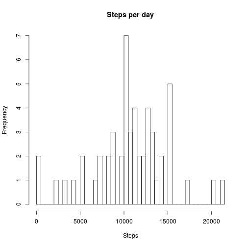
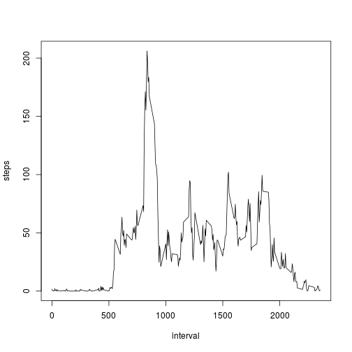
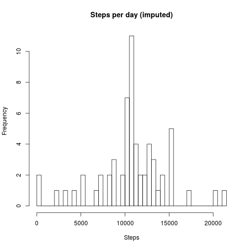
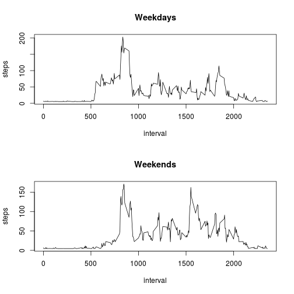

##load libraries

```r
library(dplyr)
library(Hmisc)
```
  
## Loading and preprocessing the data

```r
activity <- read.table(unz("activity.zip", "activity.csv"), header = TRUE, sep = ",", quote = "\"")
totals <- activity %>% na.omit() %>% group_by(date) %>% dplyr::summarize(steps = sum(steps))
hist(totals$steps, breaks=53, main="Steps per day", xlab="Steps")
```


  
## What is mean total number of steps taken per day?

```r
m1 <- as.integer(mean(totals$steps))
```
###The mean is 10766.

```r
m2 <- as.integer(median(totals$steps))
```
###The median is 10765.
  
## What is the average daily activity pattern?

```r
fives <- activity %>% na.omit() %>% group_by(interval) %>% dplyr::summarize(steps = mean(steps))
with(fives, plot(x = interval, y = steps, type = "l"))
```



```r
mx <- arrange(fives,desc(steps))[1,1]
```
###The interval with max steps is 835.  
  
## Imputing missing values

```r
cc <- sum(!complete.cases(activity))
```
###There are 2304 incomplete cases (rows with NA)
##I will use the impute function from the Hmisc package to fill in the NA values

```r
steps.i <- impute(activity$steps, mean)
activity.i <- activity
activity.i[,1] <- steps.i
totals.i <- activity.i %>% group_by(date) %>% dplyr::summarize(steps = sum(steps))
hist(totals.i$steps, breaks=53, main="Steps per day (imputed)", xlab="Steps")
```



```r
m1.i <- as.integer(mean(totals.i$steps))
```
###The mean of imputed steps is 10766.

```r
m2.i <- as.integer(median(totals.i$steps))
```
###The median of imputed steps is 10766.
  
###The median has increased by a single step.
###The addition of imputed data seems to have made no significant impact.
  
## Are there differences in activity patterns between weekdays and weekends?

```r
vwdays <- as.factor(weekdays(as.Date(activity.i$date)))
wkdays <- as.factor(ifelse(vwdays %in% c("Monday","Tuesday","Wednesday","Thurdsday","Friday"), "weekday", "weekend"))
activity.i$wkday <- wkdays
fiveswkdays <- activity.i %>% filter(wkdays == "weekday") %>% group_by(interval) %>% dplyr::summarize(steps = mean(steps))
fiveswkends <- activity.i %>% filter(wkdays == "weekend") %>% group_by(interval) %>% dplyr::summarize(steps = mean(steps))
par(mfrow=c(2,1))
with(fiveswkdays, plot(x=interval, y=steps, type="l", main="Weekdays"))
with(fiveswkends, plot(x=interval, y=steps, type="l", main="Weekends"))
```


